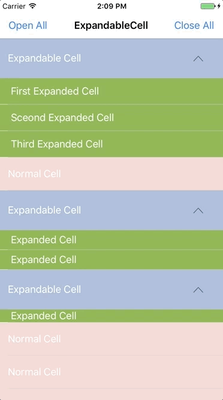

# ExpandableCell
[](https://github.com/sindresorhus/awesome)
[](http://cocoapods.org/pods/ExpandableCell)
[](https://github.com/Carthage/Carthage)
[](https://github.com/younatics/YNExpandableCell/blob/master/LICENSE)
[](http://cocoapods.org/pods/ExpandableCell)
[](https://developer.apple.com/swift/)


#### Find someone who want to make this project better than before :) Currently, I don't have enough time to resolve issues :(

## Intoduction
Fully refactored [YNExapnadableCell](https://github.com/younatics/YNExpandableCell) with more concise, bug free. Easiest usage of expandable & collapsible cell for iOS, written in Swift 3. You can customize expandable `UITableViewCell` whatever you like. `ExpandableCell` is made because `insertRows` and `deleteRows` is hard to use. Just inheirt `ExpandableDelegate`



## Usage
### Basic
```swift
import ExpandableCell
```

Make `ExpandableTableView` in Storyboard or in code
```swift
@IBOutlet var tableView: ExpandableTableView!
```

Inherit `ExpandableDelegate`
```swift
class ViewController: UIViewController, ExpandableDelegate 
```

Set delegate
```swift
tableView.expandableDelegate = self
```

Set required `ExpandableDelegate` method.
#### Key two methods
| Required ExpandableDelegate | Explanation |
| --------------------------- | ----------- |
| `func expandableTableView(_ expandableTableView: ExpandableTableView, expandedCellsForRowAt indexPath: IndexPath) -> [UITableViewCell]?` | Key method to get expandable cells |
| `func expandableTableView(_ expandableTableView: ExpandableTableView, heightsForExpandedRowAt indexPath: IndexPath) -> [CGFloat]?` | Key method to get expandable cells's height |

| Required UITableViewDelegate, UITableViewDataSource | Explanation |
| --------------------------------------------------- | ----------- |
| `func expandableTableView(_ expandableTableView: ExpandableTableView, cellForRowAt indexPath: IndexPath) -> UITableViewCell` | - |
| `func expandableTableView(_ expandableTableView: ExpandableTableView, numberOfRowsInSection section: Int) -> Int` | - |
| `func expandableTableView(_ expandableTableView: ExpandableTableView, heightForRowAt indexPath: IndexPath) -> CGFloat` | - |

### Advanced
#### ExpandableTableView property
| Property | Type | Explanation |
| -------- | ---- | ----------- |
| `animation` | `UITableViewRowAnimation` | Animation when open and close | 
| `expansionStyle` | `ExpandableTableView.ExpansionStyle` | Select expansion type:<br>**single** - one row at a time;<br>**singlePerSection** - one row at a time, per section;<br>**multi** - any number of rows at a time|
| `autoRemoveSelection` | `Bool` | autoRemoveSelection on means the cell will flicker selected, and autoRemoveSelection off means the default selection behaviour of the tableview will apply (single or multi selection) | 

#### ExpandableTableView methods
| Method | Explanation |
| ------ | ----------- |
| `openAll` | Open all that you set in `func expandableTableView(_ expandableTableView: ExpandableTableView, expandedCellsForRowAt indexPath: IndexPath) -> [UITableViewCell]?` |
| `closeAll` | Close all that you set in `func expandableTableView(_ expandableTableView: ExpandableTableView, expandedCellsForRowAt indexPath: IndexPath) -> [UITableViewCell]?` |
| `reloadData` | TableView reload data. Expanded cells will be work also |
| `open(at indexPath: IndexPath)` | Open specific indexPath |

#### Optional delegates
| Optional ExpandableDelegate | Explanation |
| --------------------------- | ----------- |
| `func expandableTableView(_ expandableTableView: ExpandableTableView, didSelectExpandedRowAt indexPath: IndexPath)` | Get indexpath in expanded row |
| `func expandableTableView(_ expandableTableView: ExpandableTableView, expandedCell: UITableViewCell, didSelectExpandedRowAt indexPath: IndexPath)` | Get expandedCell and indexPath |


| Optional UITableViewDelegate, UITableViewDataSource | Explanation |
| --------------------------------------------------- | ----------- |
| `func expandableTableView(_ expandableTableView: ExpandableTableView, didSelectRowAt indexPath: IndexPath)` | - | 
| `func expandableTableView(_ expandableTableView: ExpandableTableView, titleForHeaderInSection section: Int) -> String?` | - |
| `func expandableTableView(_ expandableTableView: ExpandableTableView, heightForHeaderInSection section: Int) -> CGFloat` | - |
| `func expandableTableView(_ expandableTableView: ExpandableTableView, viewForHeaderInSection section: Int) -> UIView?` | - |
| `func numberOfSections(in expandableTableView: ExpandableTableView) -> Int` | - |
| `func expandableTableView(_ expandableTableView: ExpandableTableView, willDisplay cell: UITableViewCell, forRowAt indexPath: IndexPath)` | - |
| `func expandableTableView(_ expandableTableView: ExpandableTableView, willDisplayHeaderView view: UIView, forSection section: Int)` | - |
| `func expandableTableView(_ expandableTableView: ExpandableTableView, willDisplayFooterView view: UIView, forSection section: Int)` | - |

#### For arrow effect
Inherit `ExpandableCell` when you need arrow effect or change arrow image
```swift
open class ExpandableCell: UITableViewCell {
    open var arrowImageView: UIImageView!
}
```

Set tableview insert animation
```Swift
tableView.animation = .automatic
```

Make protocols in `ExpandableDelegate` if you need or make pull request to me :)

#### ExpandableCell methods

| ExpandableCell methods | Explanation |
| --------------------------- | ----------- |
| `isExpanded()` | Check if cell is expanded or not |
| `isInitiallyExpanded()` | Make cell be open when the tableView content first appears in the view |
| `isSelectable()` | Make cell be selectable or not, regardless of tableView selectionStyle |

## Requirements
`ExpandableCell` written in Swift 4.2. Compatible with iOS 8.0+

## Installation

### Cocoapods

ExpandableCell is available through [CocoaPods](http://cocoapods.org). To install
it, simply add the following line to your Podfile:

```ruby
pod 'ExpandableCell'
```
### Carthage
```
github "younatics/ExpandableCell"
```

## References
#### Please tell me or make pull request if you use this library in your application :) 

## Author
[younatics](https://twitter.com/younatics)
<a href="http://twitter.com/younatics" target="_blank"></a>

## License
ExpandableCell is available under the MIT license. See the LICENSE file for more info.
